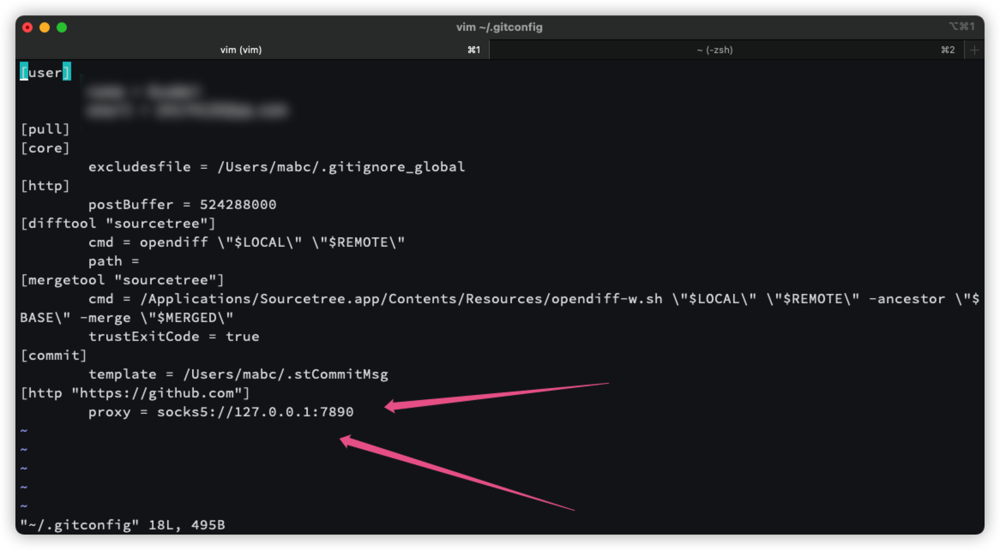

## 原因以及经过

此前因为 SSR 失效了

换了 Clash 翻墙的端口也随之变成了 7890

奇怪而折磨的事情也随之发生了, 终端 git clone 失效了

一直显示 failed to connect to 127.0.0.1:1086 

去 google 几乎全部都在说 需要在终端各种 reset proxy

包括 export http https 或者 vim ~/.bash_profile 添加各种代理的方法

但这些措施全部都是给 终端翻墙的

当然我的搜索也有问题, 因为我搜索的是 终端无法 git clone 这里的误会在于我认为 执行 git clone 这个操作的是终端

但实际上执行 git clone 这个操作的软件是 git...

那么其实是终端先需要翻墙 然后 git 也要设置对监听的端口...

弄清楚原理之后, 那么需要跑去重新设置 git 监听的 1086 端口...怪不得一直 git clone 显示的fail to 1086 端口!!!

## 解决办法如下

1. 重新设置 git 的配置文件

2. `vim ~/.gitconfig` 当然也可以直接去 finder 找到这个隐藏的配置文件修改对应的端口
3. 

保存 或者 source 一下文件生效 然后就解决问题了... 成功 git clone 了... 唉